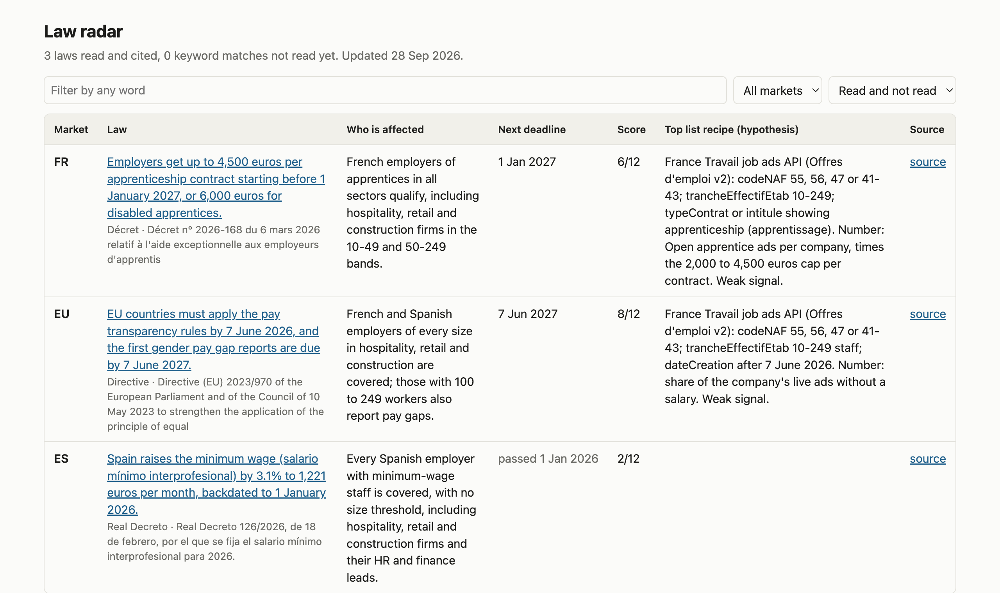

# law-radar

Weekly monitor for the EU, French and Spanish official journals. Matches new legal texts against an ICP config, extracts cited facts, and scores each law as an outbound trigger.



*Pages table from the golden test run: three real laws, read and cited for the fictional ICP "Ledgerly".*

## What it does

- Pulls new texts weekly from the EU Official Journal (Cellar), the Journal officiel (DILA open data) and the BOE (open data API).
- Filters them by keyword, classification code and a watchlist of EU directives awaiting national transposition.
- Extracts facts per law: who is affected, thresholds, dates, amounts, penalties.
- Validates every fact against the source: the quote must be verbatim, sit in the cited article and contain every number and date in the sentence. Failed facts are dropped.
- Scores each law on five signals (forcing mechanism, findable, early, gap evidence, crowding) and proposes list recipes from a catalogue of verified public datasets.
- Publishes a weekly GitHub Issue, a Pages table and Markdown + JSON digests.

Fetching and filtering run free on GitHub Actions. The model steps run through `/digest` in Claude Code at no API cost, or through the Claude API if a key is set.

## Pipeline

```
fetch -> dedupe -> keyword/code filter -> relevance filter -> read -> validate + lint -> score -> publish
```

| Stage | Runs in | Output |
|---|---|---|
| fetch | adapters `eu_cellar`, `fr_dila`, `es_boe` | one `Document` per new text |
| dedupe | `state/seen.json` | unseen texts only |
| keyword/code filter | code | `digests/YYYY-WW.matches.json` |
| relevance filter | model | yes/no with a reason |
| read | model | facts with article, verbatim quote and URL |
| validate + lint | code | facts that fail the citation check are dropped; sentences that fail the writing or number checks are rewritten once, then dropped |
| score | model per line, code for totals | scorecard out of 12, list recipes from `datasets.yaml` |
| publish | code | Issue, Pages, `digests/YYYY-WW.{md,json}` |

## Use case

Regulation-led outbound. A new law gives a set of companies a date, a cost and a rule. law-radar surfaces those laws, cites them, and points to the public datasets that name the affected companies.

## Requirements

Python 3.9+, `httpx`, `pydantic`, `pyyaml`. `anthropic` is optional (`pip install -e ".[api]"`). Tests: `pytest` (93 tests, including golden replays), run in CI on Python 3.9 and 3.12.

## Quickstart

You don't need to code. You need a GitHub account, and for the free summaries, Claude Code.

### 1. Get your own copy

On this repository's GitHub page, click **Fork** (top right). That gives you your own copy under your account. If you prefer working on your computer, clone it instead:

```bash
git clone https://github.com/analev4/law-radar.git
```

### 2. Add your ICP

Copy `icp.example.yaml` to `icp.yaml` and fill it in. Every field, with the fictional Ledgerly example beside it:

| Field | What it means | Ledgerly example |
|---|---|---|
| `icp.name` | Your company name, shown in the digest | `Ledgerly` |
| `icp.description` | One line on what you sell, to whom | `Payroll and HR software for companies with 10-249 staff in France and Spain.` |
| `icp.markets` | Countries you sell into (ISO codes). EU law is always read. | `[FR, ES]` |
| `icp.sectors` | Your customers' sectors, with their codes (NACE for the EU, NAF for France, CNAE for Spain) | Hospitality (NACE I56, NAF 56, CNAE 56), accommodation, retail, construction |
| `icp.size_bands` | Company sizes, in staff | `["10-49", "50-249"]` |
| `icp.buyer_roles` | Who buys from you | `["HR manager", "Finance lead"]` |
| `icp.topics` | The kinds of law that matter to you | employment and hiring, pay and payroll, pay transparency, social contributions |
| `keywords.en` / `.fr` / `.es` | Words that pull a text in, per language. A word ending in `*` matches as a prefix. | `pay, wage*`; `salaire*, apprenti*`; `salari*, cotizaci*` |
| `keywords.exclude` | Words that push a text out, unless a classification code matched | `fishing*, pêche, pesca*` |
| `sources` | Which journals to read, and their classification codes | EU directory `05` (social policy); Spanish subject codes such as `6256` (minimum wage) |
| `watch.directives` | EU directives to follow into French and Spanish law | `32023L0970` (pay transparency) |
| `delivery` | Where results go | Issue and Pages on; Slack, email and Notion off |
| `limits` | Weekly caps | 10 texts for `/digest`, 25 in API mode |

`icp.yaml` is gitignored, so it never leaves your computer. The weekly run on GitHub can't see it, though. To give it your ICP, store the file as a secret:

1. In your fork: **Settings > Secrets and variables > Actions > New repository secret**.
2. Name: `ICP_YAML`. Value: paste the whole content of your `icp.yaml`.

Do this in any case if your fork is public: the secret keeps your ICP private. Without the secret, the weekly run uses the fictional Ledgerly example.

### 3. Turn on the weekly run

1. In your fork, open the **Actions** tab and click the button to enable workflows (forks start with them switched off).
2. Forks also start with Issues switched off. Turn them on in **Settings > General > Features > Issues**.
3. To try it now, open **Actions > weekly > Run workflow**. Otherwise it runs every Monday at 06:00 UTC.

The weekly run is free. It needs no key and makes no model calls. It lists the texts that match your ICP, commits them to `digests/`, and opens the week's Issue.

### 4. Get the AI summaries: two ways

**Free, with Claude Code (the default).** On your computer, in your copy of the repository (with your `icp.yaml` in it), open [Claude Code](https://code.claude.com/docs) and type:

```
/digest
```

It pulls the week's matches, then asks Claude to judge, read and score up to 10 texts. It runs the same citation checks and linter as API mode and writes `digests/YYYY-WW.md`. Review the file, then commit and push. The Issue and the Pages table update by themselves. This uses your Claude plan, with no API bill. It needs Python 3.9 or newer, which macOS already has. This repository's own digests and its test recordings were made this way.

**Automatic, with the Claude API (optional).** Add a repository secret named `ANTHROPIC_API_KEY`. The weekly run then writes the summaries itself, using Claude Haiku 4.5 for the relevance filter and Claude Sonnet 5 for reading and scoring. A typical week costs an estimated **$0.30 to $1.50**: about 25 keyword matches through the filter, and 3 to 8 texts read in full. The cap of 25 texts keeps the worst week under about $8. These are estimates from token counts, at the prices of 24 September 2026 ($1/$5 and $2/$10 per million input/output tokens). Set a monthly spend limit in the [Claude Console](https://platform.claude.com) before you add the key.

### 5. Where results appear

- **The weekly Issue**, "Law radar: week NN". GitHub emails you when it opens if you watch the repository (**Watch > All activity**, or **Custom > Issues**).
- **The Pages table**, at `https://<your-user>.github.io/law-radar/`: one row per law, sorted by next deadline. To switch it on, go to **Settings > Pages > Source: GitHub Actions**, then add a repository variable `PAGES_ENABLED` set to `true` (**Settings > Secrets and variables > Actions > Variables**). On GitHub's free plan, Pages needs a public repository. Until then, each run attaches the table as a download.
- **The `digests/` folder**: one Markdown file and one JSON file per week, plus `.matches.json` with the week's keyword matches.

Optional channels, all off by default: Slack (`SLACK_WEBHOOK_URL`), email (`SMTP_HOST`, `SMTP_PORT`, `SMTP_USER`, `SMTP_PASSWORD`, `MAIL_FROM`, `MAIL_TO`) and a Notion database (`NOTION_TOKEN`, `NOTION_DATABASE_ID`). Switch one on under `delivery` in your ICP and add its secrets.

### 6. Adding a country

Each journal is one adapter behind a small interface. [CONTRIBUTING.md](CONTRIBUTING.md#writing-a-source-adapter) explains how to add one, for example Germany or Italy, without touching the rest of the pipeline.

## Example output

A real entry, from the golden test run with the Ledgerly ICP: Décret n° 2026-168, read in full and cited. The source list is shortened here; the full entry cites 20 passages.

> ### Employers get up to 4,500 euros per apprenticeship contract starting before 1 January 2027, or 6,000 euros for disabled apprentices.
>
> **FR** · Décret · [Décret n° 2026-168 du 6 mars 2026 relatif à l'aide exceptionnelle aux employeurs d'apprentis](https://www.legifrance.gouv.fr/jorf/id/JORFTEXT000053634597) · published 7 March 2026 · confidence: high
>
> **What changed:** A new decree creates an exceptional aid (aide exceptionnelle) for the first year of apprenticeship contracts starting before 1 January 2027. Firms under 250 staff get up to 4,500 euros at level 5 and up to 2,000 euros at levels 6 to 7.
>
> **Who:** French employers of apprentices in all sectors qualify, including hospitality, retail and construction firms in the 10-49 and 50-249 bands.
>
> **When:** deadline 1 January 2027 (Article 1, I)
>
> **Penalty / money at stake:** Under-250 firms get up to 4,500 euros per contract, or 6,000 euros for disabled apprentices, and must repay aid received without entitlement.
>
> **Scorecard (6/12):**
> - Forcing mechanism: **yes**. Contracts starting before 1 January 2027 earn up to 4,500 euros each, and the aid stops when payroll declaration data is missing.
> - Findable: **yes**. France Travail job ads name the employer, with codeNAF, trancheEffectifEtab and typeContrat fields to isolate firms under 250 staff.
> - Early: **yes**. Job ads are live and updated continuously, so hiring shows up before contracts start and before the 1 January 2027 cutoff.
> - Gap evidence: **no**. No catalogue dataset records which employers claim the aid, and claims run through the skills operator and payment agency.
> - Crowding: **yes**. The skills operator and payment agency already process the claim, and the award is automatic for firms under 250 staff.
>
> **List recipes (hypotheses to test):**
> 1. [France Travail job ads API](https://francetravail.io/data/api/offres-emploi). Filter: codeNAF 55, 56, 47 or 41-43; trancheEffectifEtab 10-249; typeContrat or intitule showing apprenticeship (apprentissage). Gap: open apprentice ad dated before 1 January 2027, so the contract is not yet signed. Number: open apprentice ads per company, times the 2,000 to 4,500 euros cap per contract. *Weak signal*: an open ad shows hiring intent, not an unclaimed aid.
>
> **Sources:**
> - [Article 1, II](https://www.legifrance.gouv.fr/jorf/id/JORFTEXT000053634597): "Le montant de l'aide est de 4 500 euros maximum pour les contrats mentionnés au 1° du I"
> - [Article 1, II](https://www.legifrance.gouv.fr/jorf/id/JORFTEXT000053634597): "Toutefois, ce montant est porté à 6 000 euros maximum pour les contrats mentionnés au I qui sont conclus avec une personne reconnue travailleur handicapé."
> - [Article 1, I](https://www.legifrance.gouv.fr/jorf/id/JORFTEXT000053634597): "Les contrats d'apprentissage dont la date de début d'exécution intervient avant le 1er janvier 2027 ouvrent droit à une aide exceptionnelle au titre de la première année d'exécution du contrat versée à l'employeur par l'Etat"
> - … 17 more
>
> **Confidence:** high. The decree states amounts, size thresholds and the 2027 cut-off directly, but its application date depends on a publication date the text does not give.

The first live week is in [digests/2026-39.md](digests/2026-39.md): 24 keyword matches from 345 texts. A `/digest` run capped at 3 texts, one per market, read and cited two laws: a French order on construction firms' bad-weather contributions, and a Spanish notice confirming a decree-law for Ceuta. The relevance filter rejected the EU text.

**Building the list.** Recipes point to datasets in [`datasets.yaml`](datasets.yaml), each checked for access, fields and licence. For Spain, `law-radar bdns --since 2026-09-01 --text contratación` exports grants awarded to companies from the national grants database. Records about individuals are dropped by tax ID before anything is saved, because its licence only allows reuse of personal data for scrutiny of public administration.

## Design principles

1. **Primary sources only.** Official journals and legislation databases. No news sites, law-firm blogs or vendor content.
2. **Every claim cites the text.** Each fact carries the article, a verbatim quote and the link. Code checks that the quote is in the fetched text and in the cited article, and that every number, date and month in the sentence appears in it. Facts that fail are dropped, not softened.
3. **"Nothing relevant this week" is a valid result.** An empty week says so in one line.
4. **Not legal advice.** The tool flags and summarises. Every output says so.
5. **No personal data.** It reads laws, not people. Sections about named people (appointments, naturalisations) are never read, quotes that name a person are dropped, and datasets are filtered to companies.
6. **Configurable by anyone.** Everything about your ICP lives in one file.
7. **AI only where it earns its place.** Fetching, filtering by keyword, dedupe, scheduling and publishing are plain code. `--no-ai` works at zero cost.

## Adding a source

See [CONTRIBUTING.md](CONTRIBUTING.md#writing-a-source-adapter). In short: check the source's access, limits and licence first and record them in [SOURCES.md](SOURCES.md), write one adapter with `fetch_since(date)` and `fetch_text(doc)`, and add tests on a trimmed copy of a real payload.

## Limits

- **Not legal advice.** law-radar reports what the fetched text says. Read the source before acting.
- **One text, one view.** A decree can change one scheme while another still applies. Example: Décret n° 2026-168 sets the "aide exceptionnelle" (€4,500 for a level 5 apprentice in a company under 250 staff), while the separate "aide unique" pays €5,000 for companies under 250 staff at CAP to Bac level. That amount was set by Article 1 of Décret n° 2025-174 of 22 February 2025, which rewrote Code du travail D6243-2, and is listed on [service-public.fr, F23556](https://entreprendre.service-public.gouv.fr/vosdroits/F23556). The digest of the 2026 decree mentions only what that decree says.
- **The checks cover quotes, not meaning.** The validator proves that each quote is real, sits in the cited article, and supports every number and date in the sentence. It can't prove that a summary sentence captures the whole meaning of the quote.
- **Test answers were recorded with Claude Code.** The golden tests replay answers written in Claude Code sessions. Each request was answered by a fresh subagent that saw only that request, not the tests. Each recording stores a fingerprint of its request, so a changed prompt forces a new recording. `/digest` uses the same path.
- **Datasets are thin.** Recipes use only the datasets in `datasets.yaml`. Spain has no public dataset that names companies with their size, so Spanish laws score lower on "findable".
- **Transposition flags** rely on the national text saying it transposes a named directive. That is required by EU law, but a text that forgets it will be missed.
- **Sources change.** EUR-Lex and Légifrance block automated readers, so law-radar reads the same texts from the Publications Office (Cellar) and DILA open data, and links to EUR-Lex and Légifrance for people. See [SOURCES.md](SOURCES.md).
- **Slack, email and Notion** are tested against simulated services only.

Sources: EUR-Lex / Publications Office of the EU (CC BY 4.0); DILA, Journal officiel (Licence Ouverte 2.0); Basado en datos de la Agencia Estatal Boletín Oficial del Estado; grants: Origen de los datos, Intervención General de la Administración del Estado.

## Licence

MIT for the code. The legal texts keep their own licences, credited above and in every digest.
